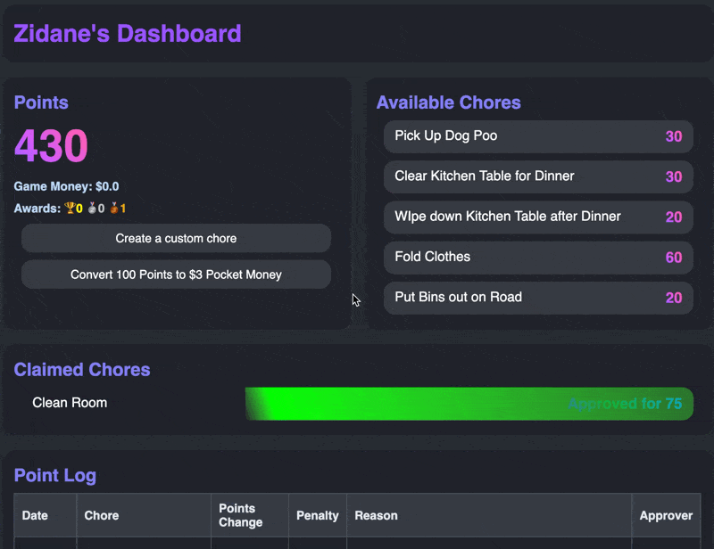
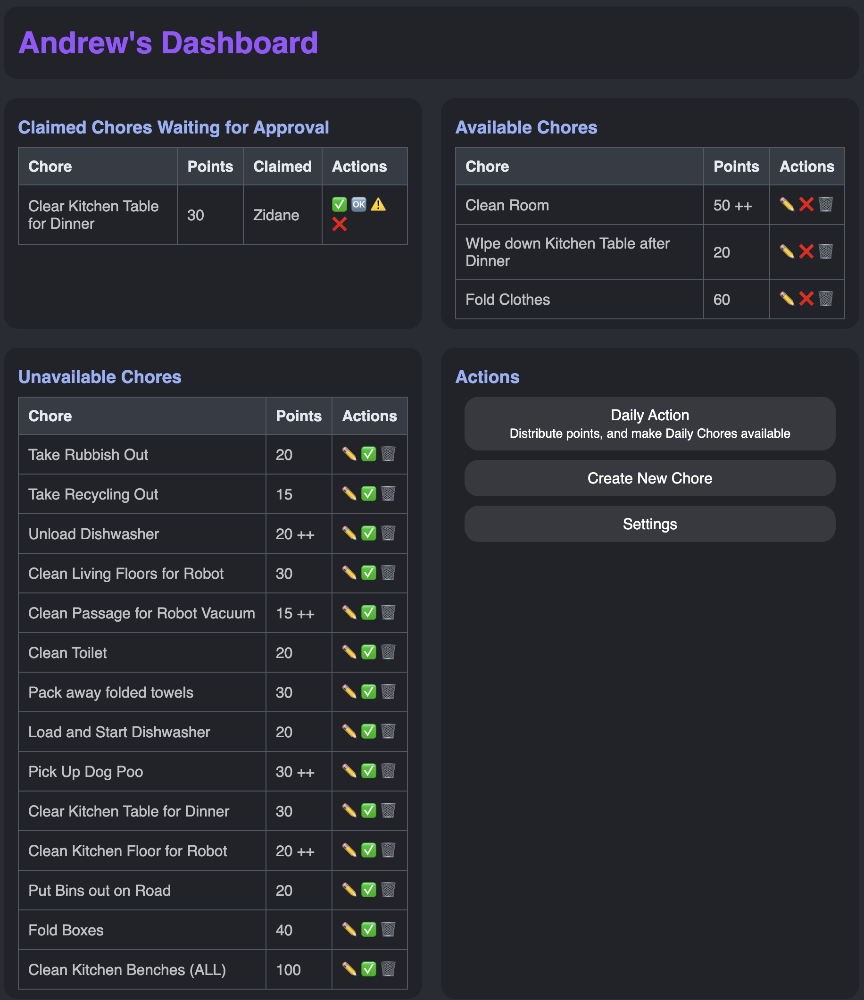

## Chore App
An attempt to gamify the chore experience.  
The reality is, chores are not fun, and unless there is a incentive, why would anyone do them?  I wouldn't!  
So, what incentive is there?  Screen time!  
Perform chores to earn points,  Points are used for screen time.  Simple.  
But we have Bonuses, Trophies, Penalties, and crazy parents too... 

Childrens Dashboard  
  

Parents Dashboard  
  

### State of the App 
It was built for me, and my family.   
I have never used django, I learnt as I went.  I also hate CSS and HTML.  
It would greatly benefit from contributers, so if you can help out, please do!  

### My future plans
Just maintain it and add things as I feel.  
Looking into the idea of using scrapy to automatically grab screen time from Microsofts Family site, since that covers off the things that matter most, PC Games and XBox.  

## Installation and Execution Instructions

### Installation
To prepare your system (Linux, MacOS, WSL2) for running the application, execute the `install.sh` script, or for Windows without WSL, the `install.bat`. This script automates the following tasks:
1. Checks for Python 3 and installs it if missing, using the appropriate package manager for your system.
2. Installs Django using Python's pip if it's not already installed.
3. Sets up the Django migrations and applies them to initialize the database.
4. Loads initial settings from `settings.json` into the database, ensuring this is done only once.

### Running the Application
MacOS, Linux, and WSL: Use the `launch.sh` script to start the application. This script handles:
1. Verifying if the `screen` utility is installed to run the application in a detached session.
2. If `screen` is available, the application starts in a new detached screen session named "chore_app". Instructions to attach to this session are provided.
3. If `screen` is not available, the application will run in the foreground.
Windows without WSL: Use the `launch.bat` script to start the application.  Same functionality as above, but no screen.

## Accessing the App
Once the app is running, open a web browser and visit `http://localhost:8000` to access it.   
It is configured to allow access from any IP, so you can access it via the computers IP.   
If you want to access it via a domain, configure your DNS and a proxy, such as nginx as required.  

### Adding Users
The authentication side has barely been used, set the username to what you want the persons name to be.  
To register a user, `http://localhost:8000/register` and fill in the form.  
Logging in as a user can be done via `http://localhost:8000/login`.  