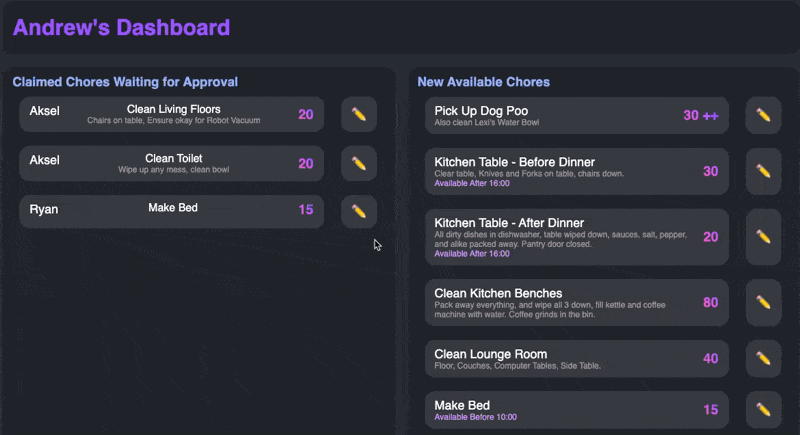

## Chore App

An attempt to gamify the chore experience.  
The reality is, chores are not fun, and unless there is a incentive, why would anyone do them?  I wouldn't!  
So, what incentive is there?  Screen time!  
Perform chores to earn points,  Points are used for screen time.  Simple.  
But we have Early Bonuses, Time Specific Chores, Leaderboards, Trophies, Penalties, and just lots of stuff...  

### Project Status, Progress, Support and Forks

The project is mostly stable now but undergoes frequent minor updates. The primary focus is on the UI, but I don't plan to dedicate much more time to it at this stage. Contributions are highly appreciated, whether they're code, kind words, or donations.  

I developed this project with my family and myself in mind, yet I've made it open and available to you, hoping it can be beneficial to a wider audience. You're encouraged to make modifications and, more importantly, to share your improvements. While your customizations might suit your individual needs, integrating them for the collective good could enhance the experience for all users.  

I'm new to Django. As I've done my best to avoid web (JS/CSS/HTML) my whole career, thus any assistance in these areas would be incredibly valuable. Your help can bridge the gaps that I don't have the time to learn and would be greatly appreciated.

#### Childrens Dashboard   
Actions such as Claiming a chore, or returning a chore, are a single tap.  
  

##### Parents Dashboard  
Primary Actions are a single tap, other actions (including the primary actions) are via a modal.  
A tap on claimed chores is approval.  
A tap on an available chore makes is unavailable, and ditto for tapping on unavailable.  
  

### State of the App

It was built for me, and my family.
I have never used django, I learnt as I went.  I also hate CSS and HTML.  
It would greatly benefit from contributers, so if you can help out, please do!  

### My future plans

Just maintain it and add things as I feel.  
Looking into the idea of using scrapy to automatically grab screen time from Microsofts Family site, since that covers off the things that matter most, PC Games and XBox.  

## Installation and Execution Instructions

### Installation

To prepare your system (Linux, MacOS, WSL2) for running the application, execute the `install.sh` script, or for Windows without WSL, the `install.bat`. This script automates the following tasks:

1. Checks for Python 3 and installs it if missing, using the appropriate package manager for your system.
2. Installs Django using Python's pip if it's not already installed.
3. Sets up the Django migrations and applies them to initialize the database.
4. Loads initial settings from `settings.json` into the database, ensuring this is done only once.

### Running the Application

MacOS, Linux, and WSL: Use the `launch.sh` script to start the application. This script handles:

1. Verifying if the `screen` utility is installed to run the application in a detached session.
2. If `screen` is available, the application starts in a new detached screen session named "chore_app". Instructions to attach to this session are provided.
3. If `screen` is not available, the application will run in the foreground.
Windows without WSL: Use the `launch.bat` script to start the application.  Same functionality as above, but no screen.

## Accessing the App

Once the app is running, open a web browser and visit `http://localhost:8000` to access it.
It is configured to allow access from any IP, so you can access it via the computers IP.
If you want to access it via a domain, configure your DNS and a proxy, such as nginx as required.  

### Adding Users

The authentication side has barely been used, set the username to what you want the persons name to be.  
To register a user, `http://localhost:8000/register` and fill in the form.  
Logging in as a user can be done via `http://localhost:8000/login`.  

### Daily Actions 

Every day there are maintenance actions that need to be performed.  
- Penalties for incomplete chores  
- Leaderboad rewards  
- Reset of daily chores
- Clearing of completed chores  
These can be done using the button "Daily Action" from the Parents Dashboard, but it can also be automated with a cron job.  
Linux only instructions for now, for how to use Windows and MacOS, use Bard, Claude, ChatGPT or any other AI, they should be able to help easily.  
Find your python location with `whereis python3`.  then launch crontab editor with `crontab -e`.  
Add a line to the file such as `* * * * * /usr/bin/python3 /opt/chore_app/manage.py runcrons >> /var/log/chore_app.log 2>&1` changing the paths as required for your setup.  
For an explanation, `* * * * *` will run every minute, `/usr/bin/python3` is the python application, `/opt/chore_app/manage.py` is the path to the manage.py file of chore_app, `>> /var/log/chore_app.log 2>&1` is the logging file location.