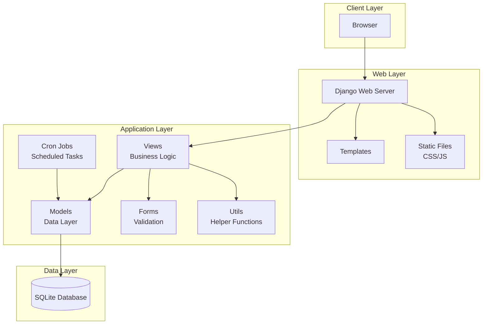
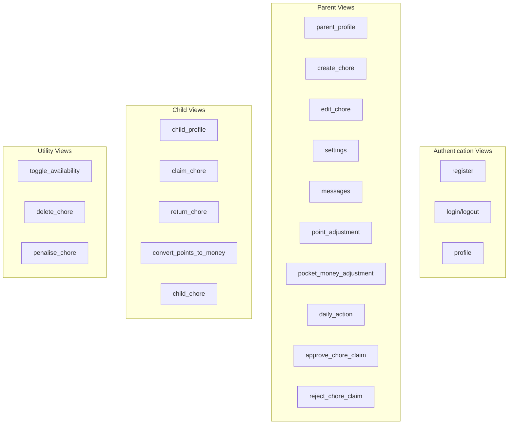
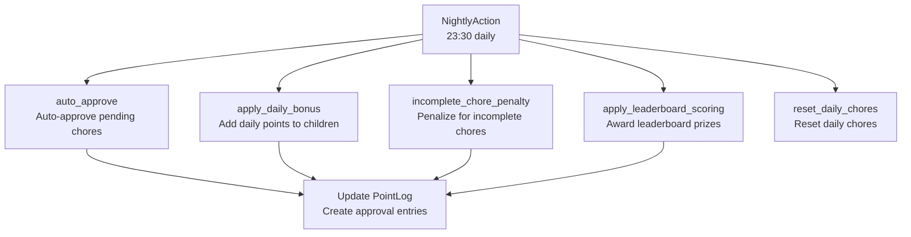
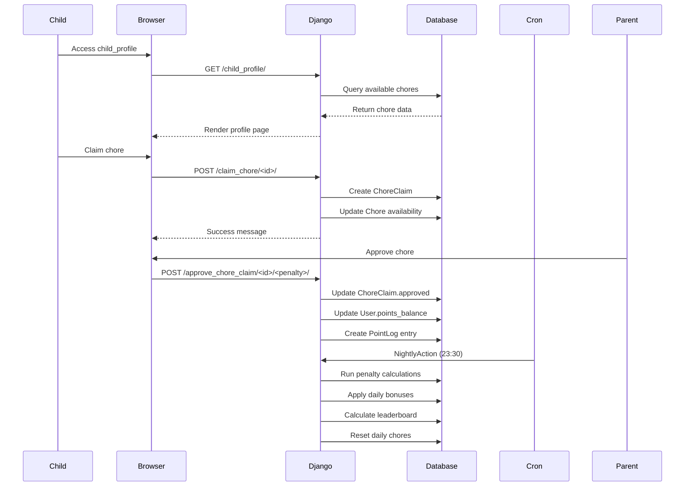

# Chore App Architecture

## Overview

The Chore App is a Django-based web application designed to manage household chores and reward systems for parents and children. The application implements a point-based system where children earn points for completing chores, which can be converted to pocket money, with various bonuses and penalties applied automatically.

## System Architecture



## Component Details

### Models (Data Layer)

```mermaid
classDiagram
    class User {
        +role: CharField (Parent/Child)
        +points_balance: DecimalField
        +pocket_money: DecimalField
        +place_1, place_2, place_3: IntegerField
    }

    class Chore {
        +name: CharField
        +points: DecimalField
        +assignment_type: CharField
        +available: BooleanField
        +daily: BooleanField
        +early_bonus: BooleanField
        +bonus_end_time: IntegerField
        +available_time: IntegerField
    }

    class ChoreClaim {
        +chore: ForeignKey
        +user: ForeignKey
        +approved: DecimalField
        +points: DecimalField
        +comment: CharField
    }

    class PointLog {
        +user: ForeignKey
        +points_change: DecimalField
        +reason: CharField
        +chore: CharField
        +penalty: DecimalField
        +date_recorded: DateTimeField
    }

    class Settings {
        +key: CharField
        +name: CharField
        +value: DecimalField
    }

    class Text {
        +key: CharField
        +text: TextField
        +enabled: BooleanField
    }

    class RunLog {
        +job_code: CharField
        +run_date: DateField
    }

    User ||--o{ ChoreClaim : claims
    User ||--o{ PointLog : logs
    Chore ||--o{ ChoreClaim : claimed_by
    Chore ||--o{ User : assigned_to
    User ||--o{ PointLog : approver
```

### Views (Business Logic Layer)



### Cron Jobs (Scheduled Tasks)



## Data Flow



## Security & Authentication

- Django's built-in authentication system
- Role-based access control (Parent/Child roles)
- CSRF protection on forms
- Session-based authentication
- Login required decorators on sensitive views

## Deployment Considerations

- SQLite database (development)
- Static file serving
- Cron job scheduling via django-cron
- Time zone: Australia/Melbourne
- Environment variable configuration for production settings