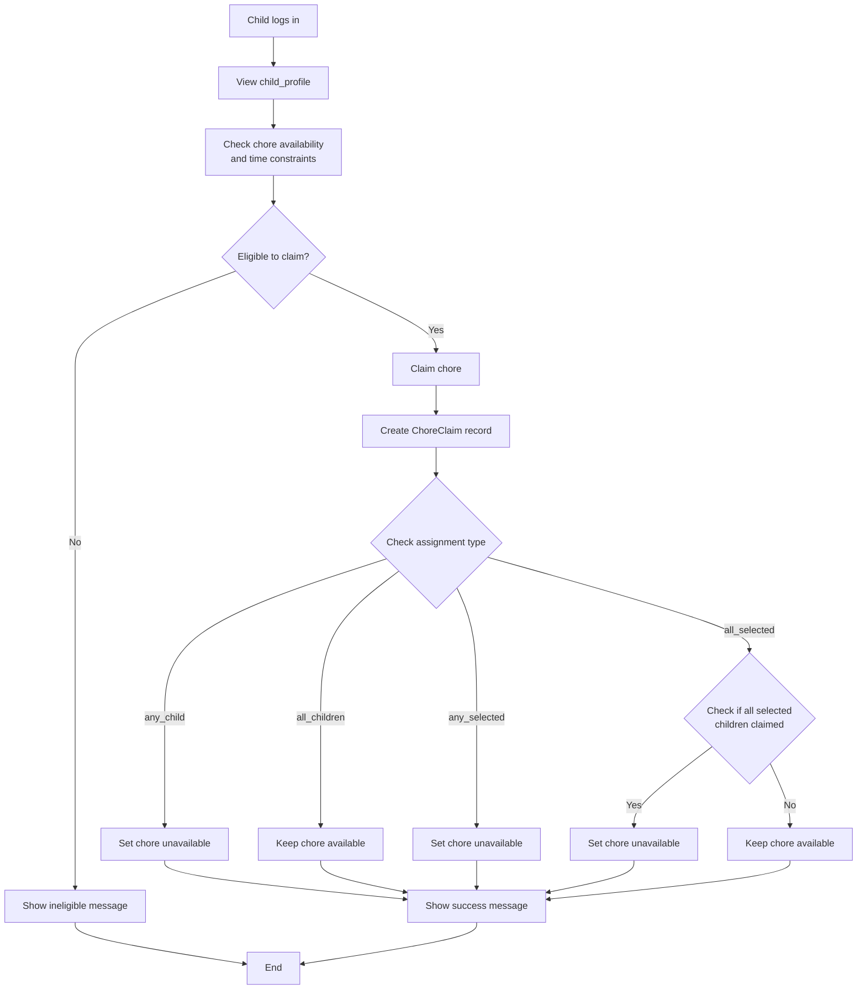
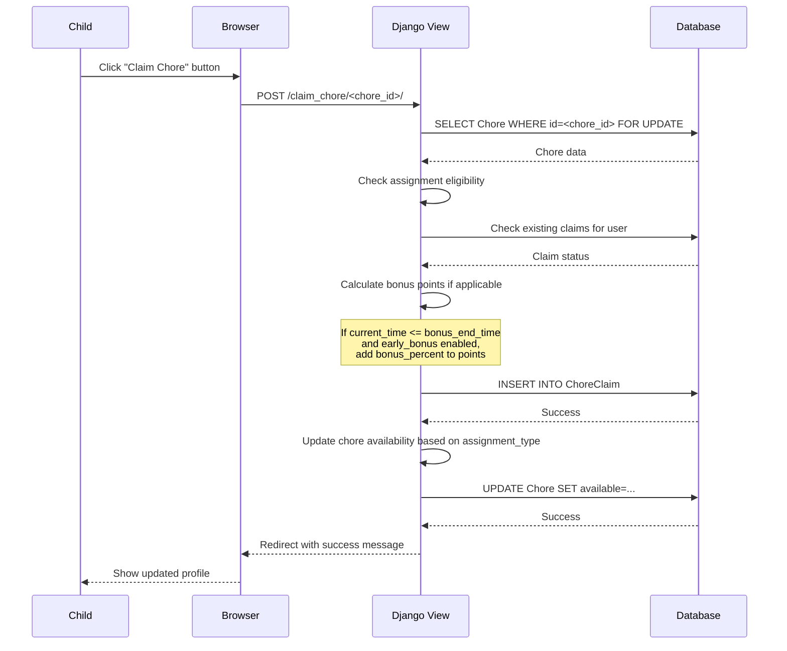
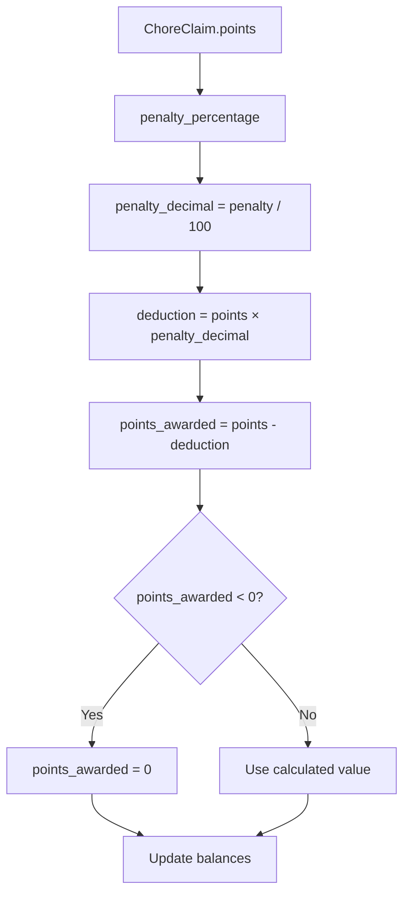
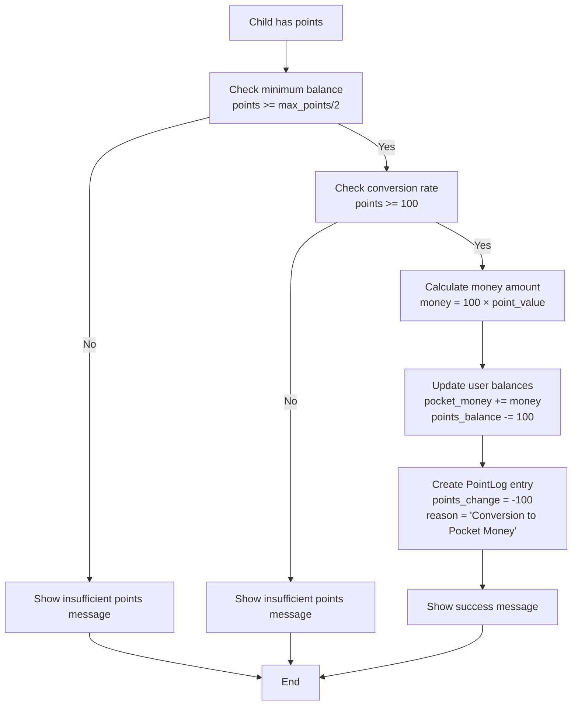
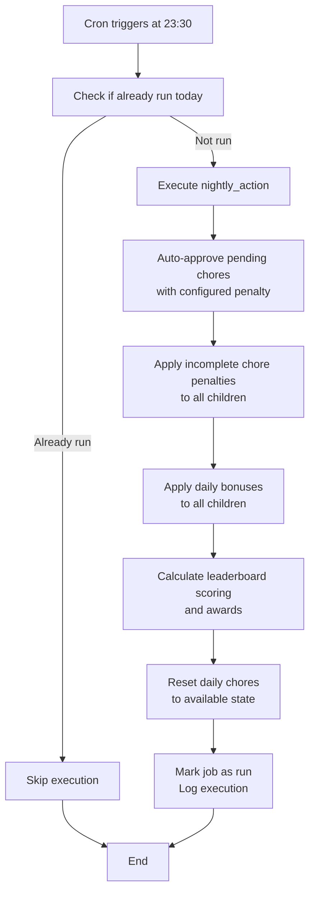
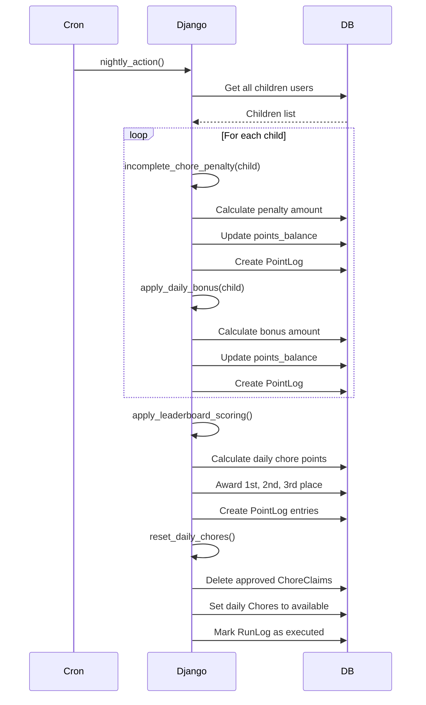
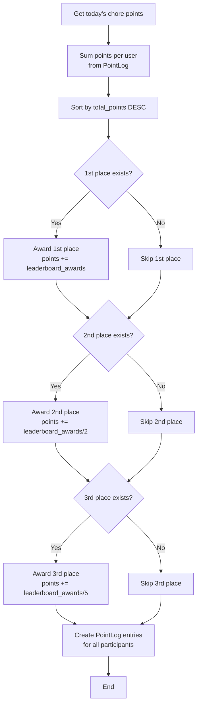
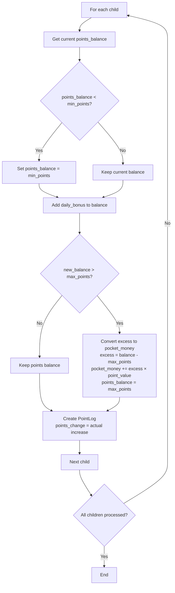
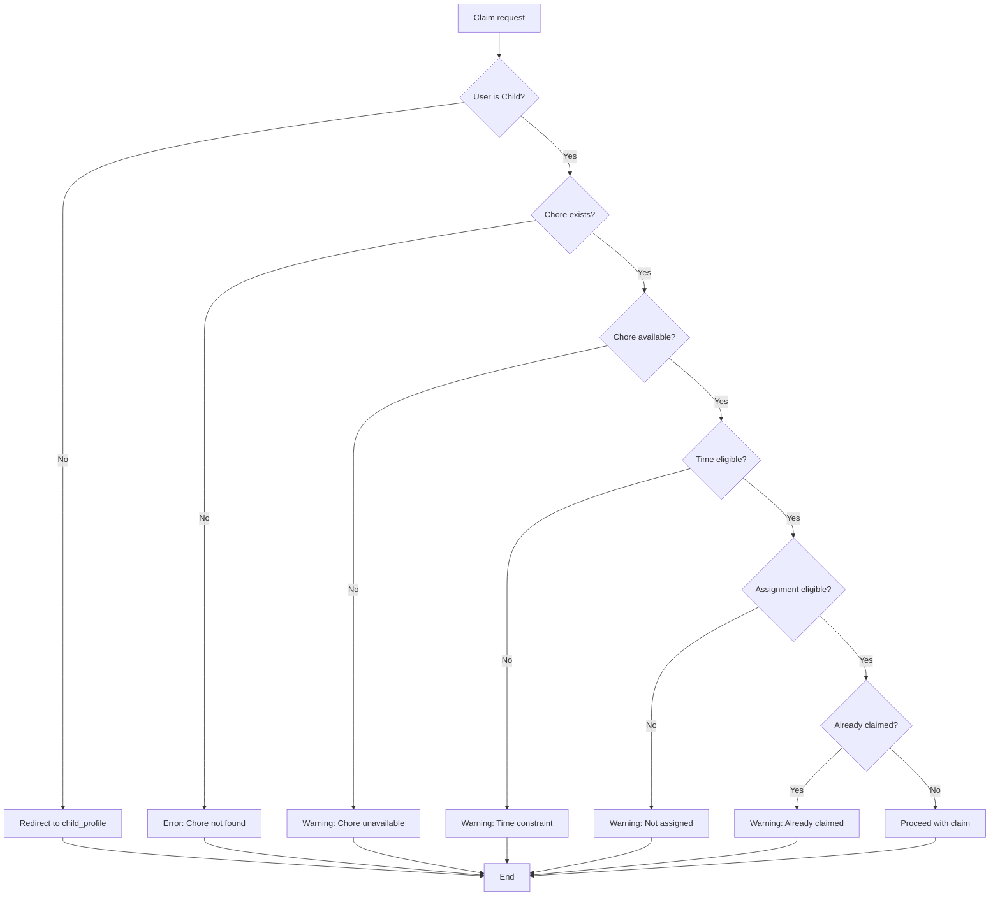

# Chore App Application Flow

## Overview

The Chore App implements several key workflows for managing household chores and rewards. This document outlines the major application flows with detailed sequence diagrams and flowcharts.

## Major Workflows

### 1. Chore Claiming Process



**Detailed Sequence:**



### 2. Chore Approval Process

```mermaid
flowchart TD
    A[Parent logs in] --> B[View parent_profile]
    B --> C[Review pending ChoreClaims]
    C --> D{Approve or Reject?}
    D -->|Approve| E[Enter penalty percentage<br/>0-100%]
    D -->|Reject| F[Reject chore claim]
    E --> G[Calculate points_awarded<br/>= points - (points × penalty/100)]
    G --> H[Update ChoreClaim.approved]
    H --> I[Add points to user balance]
    I --> J[Create PointLog entry]
    J --> K{Is daily chore?}
    K -->|No| L[Set chore unavailable]
    K -->|Yes| M[Keep chore available]
    F --> N[Make chore available again]
    N --> O[Create rejection PointLog<br/>with REJECTION_PENALTY]
    L --> P[Show success message]
    M --> P
    O --> P
```

**Approval Calculation Details:**



### 3. Points to Money Conversion



### 4. Nightly Cron Job Process



**Nightly Action Sequence:**



### 5. Leaderboard Calculation



### 6. Daily Bonus Application



### 7. Incomplete Chore Penalty

```mermaid
flowchart TD
    A[For each child] --> B[Get available chores]
    B --> C[Find completed chores by child<br/>from ChoreClaim.approved > 0]
    C --> D[Calculate incomplete_sum<br/>= sum of available chore points<br/>- completed chore points]
    D --> E{incomplete_sum > 0<br/>AND penalty > 0?}
    E -->|No| F[No penalty]
    E -->|Yes| G[Calculate penalty_amount<br/>= (penalty% / 100) × incomplete_sum]
    G --> H[Subtract from points_balance]
    H --> I[Create PointLog entry<br/>points_change = -penalty_amount<br/>penalty = penalty%<br/>reason = detailed explanation]
    F --> J[Next child]
    I --> J
    J --> K{All children processed?}
    K -->|No| A
    K -->|Yes| L[End]
```

## Error Handling Flows

### Chore Claim Validation



## Data Validation Rules

- **Penalty Percentage**: Must be 0-100%
- **Points Balance**: Cannot go negative (except in specific penalty cases)
- **Chore Availability**: Time-based constraints apply
- **Assignment Types**: Strict validation for selected children
- **Daily Actions**: Can only run once per day
- **Point Conversion**: Minimum thresholds enforced